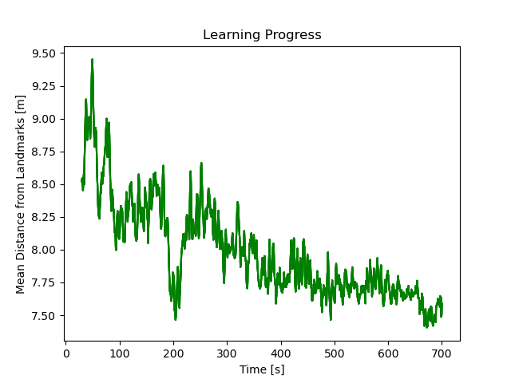
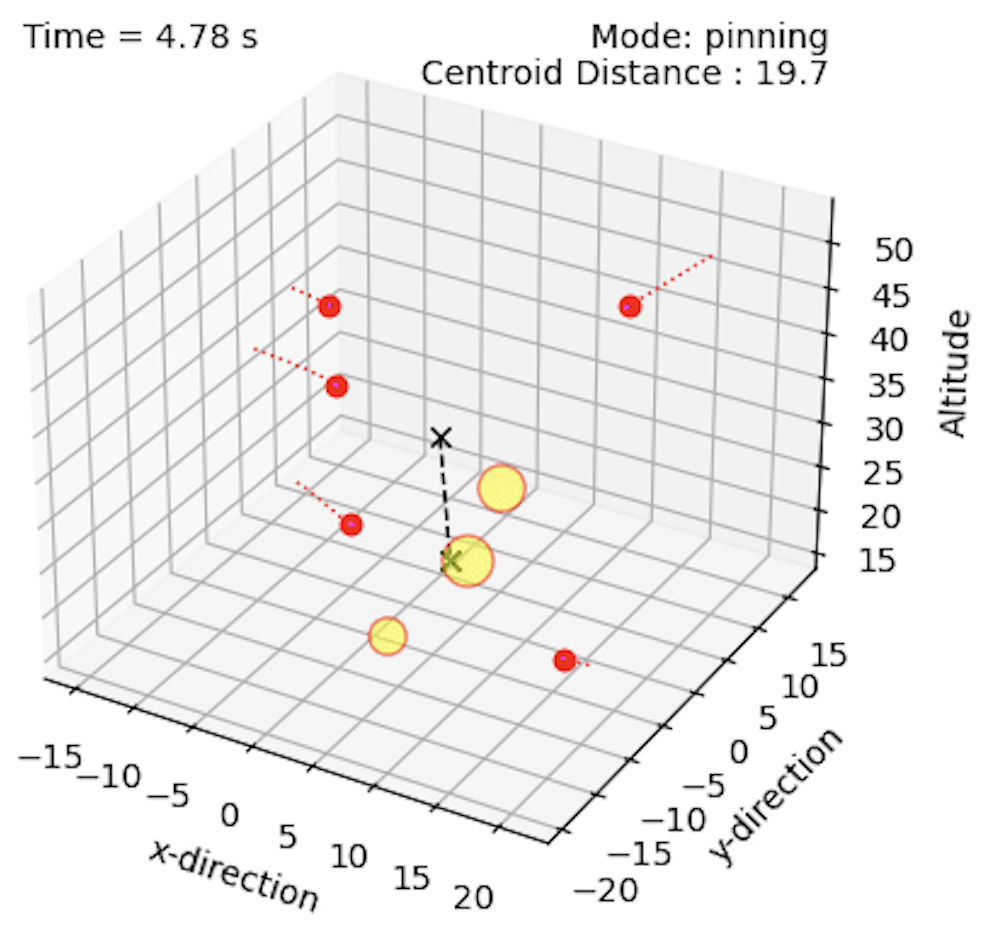
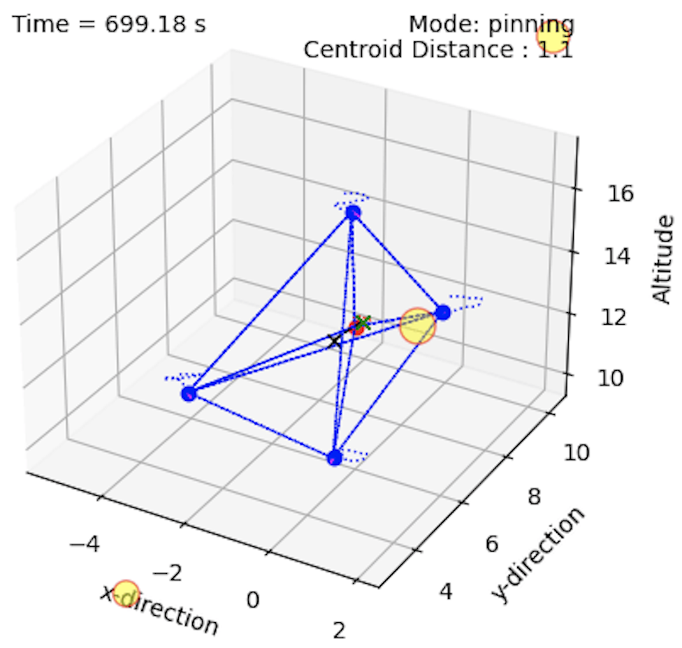

# Optimal Swarm Structures via Q-Learning

This project implements Q-learning to automatically assemble lattice structures composed of an arbitrary number of agents.
The structure is optimized to ensure maximal coverage of landmarks. 
Each agent learns optimal parameters locally and negotiates consensus with its neighbours.
The Q-table grows as new states are discovered and the exploitation rate increases exponentially with time.

Key theoretical developments:

1. The structure is assembled using **consensus**-based methods
2. **Pinning control** is used to guide the agents
3. As the agents converge and structure assembles, new pins are selected based on **degree centrality**
4. **Q-learning** is used to adjust the separation between agents
5. This local separation is what drives the global structure of the swarm
6. Agents negotiate local separation using a novel consensus-based approach

Mathematical formulations to follow. Here is a plot showing the learning progress:


    


Here is is an illustration of the agents assembling:


    
    







 

